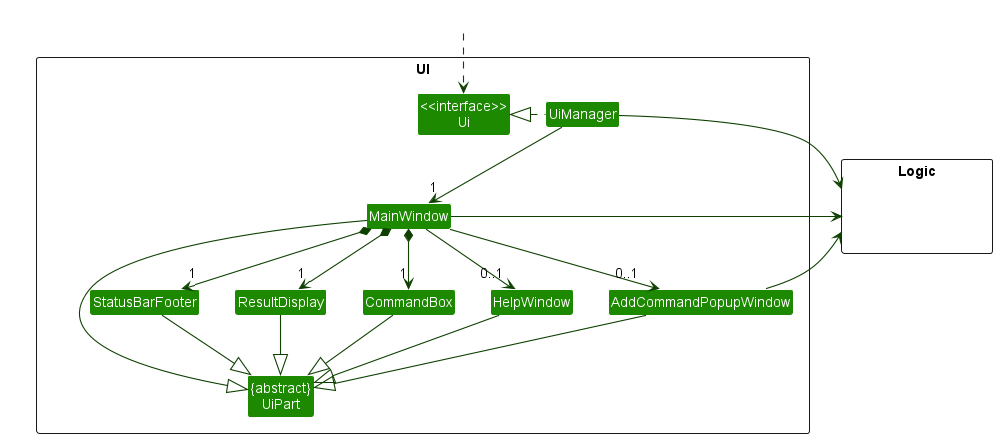
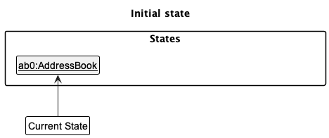
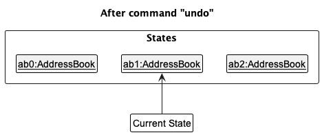
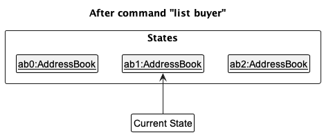

* Table of Contents
{:toc}

--------------------------------------------------------------------------------------------------------------------

## **Acknowledgements**

* {list here sources of all reused/adapted ideas, code, documentation, and third-party libraries -- include links to the original source as well}

--------------------------------------------------------------------------------------------------------------------

## **Setting up, getting started**

Refer to the guide [_Setting up and getting started_](SettingUp.md).

--------------------------------------------------------------------------------------------------------------------

## **Design**

:bulb: **Tip:** The `.puml` files used to create diagrams in this document can be found in the [diagrams](https://github.com/se-edu/addressbook-level3/tree/master/docs/diagrams/) folder. Refer to the [_PlantUML Tutorial_ at se-edu/guides](https://se-education.org/guides/tutorials/plantUml.html) to learn how to create and edit diagrams.

### Architecture

The ***Architecture Diagram*** given above explains the high-level design of the App.

Given below is a quick overview of main components and how they interact with each other.

**Main components of the architecture**

**`Main`** has two classes called [`Main`](https://github.com/se-edu/addressbook-level3/tree/master/src/main/java/seedu/address/Main.java) and [`MainApp`](https://github.com/se-edu/addressbook-level3/tree/master/src/main/java/seedu/address/MainApp.java). It is responsible for,
* At app launch: Initializes the components in the correct sequence, and connects them up with each other.
* At shut down: Shuts down the components and invokes cleanup methods where necessary.

[**`Commons`**](#common-classes) represents a collection of classes used by multiple other components.

The rest of the App consists of four components.

* [**`UI`**](#ui-component): The UI of the App.
* [**`Logic`**](#logic-component): The command executor.
* [**`Model`**](#model-component): Holds the data of the App in memory.
* [**`Storage`**](#storage-component): Reads data from, and writes data to, the hard disk.

**How the architecture components interact with each other**

The *Sequence Diagram* below shows how the components interact with each other for the scenario where the user issues the command `delete 1`.

Each of the four main components (also shown in the diagram above),

* defines its *API* in an `interface` with the same name as the Component.
* implements its functionality using a concrete `{Component Name}Manager` class (which follows the corresponding API `interface` mentioned in the previous point.

For example, the `Logic` component defines its API in the `Logic.java` interface and implements its functionality using the `LogicManager.java` class which follows the `Logic` interface. Other components interact with a given component through its interface rather than the concrete class (reason: to prevent outside component's being coupled to the implementation of a component), as illustrated in the (partial) class diagram below.

The sections below give more details of each component.

### UI component

The **API** of this component is specified in [`Ui.java`](https://github.com/se-edu/addressbook-level3/tree/master/src/main/java/seedu/address/ui/Ui.java)

The UI consists of a `MainWindow` that is made up of parts e.g.`CommandBox`, `ResultDisplay`, `PersonListPanel`, `StatusBarFooter` etc. All these, including the `MainWindow`, inherit from the abstract `UiPart` class which captures the commonalities between classes that represent parts of the visible GUI.

The `UI` component uses the JavaFx UI framework. The layout of these UI parts are defined in matching `.fxml` files that are in the `src/main/resources/view` folder. For example, the layout of the [`MainWindow`](https://github.com/se-edu/addressbook-level3/tree/master/src/main/java/seedu/address/ui/MainWindow.java) is specified in [`MainWindow.fxml`](https://github.com/se-edu/addressbook-level3/tree/master/src/main/resources/view/MainWindow.fxml)

The `UI` component,

* executes user commands using the `Logic` component.
* listens for changes to `Model` data so that the UI can be updated with the modified data.
* keeps a reference to the `Logic` component, because the `UI` relies on the `Logic` to execute commands.
* depends on some classes in the `Model` component, as it displays `Person` object residing in the `Model`.

### Logic component

**API** : [`Logic.java`](https://github.com/se-edu/addressbook-level3/tree/master/src/main/java/seedu/address/logic/Logic.java)

Here's a (partial) class diagram of the `Logic` component:

How the `Logic` component works:
1. When `Logic` is called upon to execute a command, it uses the `AddressBookParser` class to parse the user command.
1. This results in a `Command` object (more precisely, an object of one of its subclasses e.g., `AddCommand`) which is executed by the `LogicManager`.
1. The command can communicate with the `Model` when it is executed (e.g. to add a person).
1. The result of the command execution is encapsulated as a `CommandResult` object which is returned back from `Logic`.

The Sequence Diagram below illustrates the interactions within the `Logic` component for the `execute("delete 1")` API call.

:information_source: **Note:** The lifeline for `DeleteCommandParser` should end at the destroy marker (X) but due to a limitation of PlantUML, the lifeline reaches the end of diagram.

Here are the other classes in `Logic` (omitted from the class diagram above) that are used for parsing a user command:

How the parsing works:
* When called upon to parse a user command, the `AddressBookParser` class creates an `XYZCommandParser` (`XYZ` is a placeholder for the specific command name e.g., `AddCommandParser`) which uses the other classes shown above to parse the user command and create a `XYZCommand` object (e.g., `AddCommand`) which the `AddressBookParser` returns back as a `Command` object.
* All `XYZCommandParser` classes (e.g., `AddCommandParser`, `DeleteCommandParser`, ...) inherit from the `Parser` interface so that they can be treated similarly where possible e.g, during testing.

### Model component
**API** : [`Model.java`](https://github.com/se-edu/addressbook-level3/tree/master/src/main/java/seedu/address/model/Model.java)

The `Model` component,

* stores the address book data i.e., all `Person` objects (which are contained in a `UniquePersonList` object).
* stores the currently 'selected' `Person` objects (e.g., results of a search query) as a separate _filtered_ list which is exposed to outsiders as an unmodifiable `ObservableList<Person>` that can be 'observed' e.g. the UI can be bound to this list so that the UI automatically updates when the data in the list change.
* stores a `UserPref` object that represents the user’s preferences. This is exposed to the outside as a `ReadOnlyUserPref` objects.
* does not depend on any of the other three components (as the `Model` represents data entities of the domain, they should make sense on their own without depending on other components)

:information_source: **Note:** An alternative (arguably, a more OOP) model is given below. It has a `Tag` list in the `AddressBook`, which `Person` references. This allows `AddressBook` to only require one `Tag` object per unique tag, instead of each `Person` needing their own `Tag` objects. 

### Storage component

**API** : [`Storage.java`](https://github.com/se-edu/addressbook-level3/tree/master/src/main/java/seedu/address/storage/Storage.java)

The `Storage` component,
* can save both address book data and user preference data in json format, and read them back into corresponding objects.
* inherits from both `AddressBookStorage` and `UserPrefStorage`, which means it can be treated as either one (if only the functionality of only one is needed).
* depends on some classes in the `Model` component (because the `Storage` component's job is to save/retrieve objects that belong to the `Model`)

### Common classes

Classes used by multiple components are in the `seedu.addressbook.commons` package.

--------------------------------------------------------------------------------------------------------------------

## **Implementation**

This section describes some noteworthy details on how certain features are implemented.

### \[Proposed\] Undo/redo feature

#### Proposed Implementation

The proposed undo/redo mechanism is facilitated by `VersionedAddressBook`. It extends `AddressBook` with an undo/redo history, stored internally as an `addressBookStateList` and `currentStatePointer`. Additionally, it implements the following operations:

* `VersionedAddressBook#commit()` — Saves the current address book state in its history.
* `VersionedAddressBook#undo()` — Restores the previous address book state from its history.
* `VersionedAddressBook#redo()` — Restores a previously undone address book state from its history.

These operations are exposed in the `Model` interface as `Model#commitAddressBook()`, `Model#undoAddressBook()` and `Model#redoAddressBook()` respectively.

Given below is an example usage scenario and how the undo/redo mechanism behaves at each step.

Step 1. The user launches the application for the first time. The `VersionedAddressBook` will be initialized with the initial address book state, and the `currentStatePointer` pointing to that single address book state.

Step 2. The user executes `delete 5` command to delete the 5th person in the address book. The `delete` command calls `Model#commitAddressBook()`, causing the modified state of the address book after the `delete 5` command executes to be saved in the `addressBookStateList`, and the `currentStatePointer` is shifted to the newly inserted address book state.

Step 3. The user executes `add n/David …​` to add a new person. The `add` command also calls `Model#commitAddressBook()`, causing another modified address book state to be saved into the `addressBookStateList`.

:information_source: **Note:** If a command fails its execution, it will not call `Model#commitAddressBook()`, so the address book state will not be saved into the `addressBookStateList`.

Step 4. The user now decides that adding the person was a mistake, and decides to undo that action by executing the `undo` command. The `undo` command will call `Model#undoAddressBook()`, which will shift the `currentStatePointer` once to the left, pointing it to the previous address book state, and restores the address book to that state.

:information_source: **Note:** If the `currentStatePointer` is at index 0, pointing to the initial AddressBook state, then there are no previous AddressBook states to restore. The `undo` command uses `Model#canUndoAddressBook()` to check if this is the case. If so, it will return an error to the user rather
than attempting to perform the undo.

The following sequence diagram shows how the undo operation works:

:information_source: **Note:** The lifeline for `UndoCommand` should end at the destroy marker (X) but due to a limitation of PlantUML, the lifeline reaches the end of diagram.

The `redo` command does the opposite — it calls `Model#redoAddressBook()`, which shifts the `currentStatePointer` once to the right, pointing to the previously undone state, and restores the address book to that state.

:information_source: **Note:** If the `currentStatePointer` is at index `addressBookStateList.size() - 1`, pointing to the latest address book state, then there are no undone AddressBook states to restore. The `redo` command uses `Model#canRedoAddressBook()` to check if this is the case. If so, it will return an error to the user rather than attempting to perform the redo.

Step 5. The user then decides to execute the command `list`. Commands that do not modify the address book, such as `list`, will usually not call `Model#commitAddressBook()`, `Model#undoAddressBook()` or `Model#redoAddressBook()`. Thus, the `addressBookStateList` remains unchanged.

Step 6. The user executes `clear`, which calls `Model#commitAddressBook()`. Since the `currentStatePointer` is not pointing at the end of the `addressBookStateList`, all address book states after the `currentStatePointer` will be purged. Reason: It no longer makes sense to redo the `add n/David …​` command. This is the behavior that most modern desktop applications follow.

The following activity diagram summarizes what happens when a user executes a new command:

#### Design considerations:

**Aspect: How undo & redo executes:**

* **Alternative 1 (current choice):** Saves the entire address book.
  * Pros: Easy to implement.
  * Cons: May have performance issues in terms of memory usage.

* **Alternative 2:** Individual command knows how to undo/redo by
  itself.
  * Pros: Will use less memory (e.g. for `delete`, just save the person being deleted).
  * Cons: We must ensure that the implementation of each individual command are correct.

_{more aspects and alternatives to be added}_

### \[Proposed\] Data archiving

_{Explain here how the data archiving feature will be implemented}_

### Unique ID Mechanism
Initially, `Buyer` has reference to `Order` and `Order` also has reference to `Buyer`. The same applied to the cross-reference between `Supplier` and `Pet`. This kind of bidirectional navigation makes it difficult to implement some JSON-related classes and methods, since the JSON-adapted date models will infinitely recursively write the references into the `.json` file.

Our solution to this problem is to give each `Order` and `Pet` a unique ID that does not change throughout the life cycle of the object.

We considered using a unique `int` or `long` data type to represent the id, but either `int` or `long` is possible to have overflow (though very unlikely), resulting in duplicate IDs. Therefore, we thought of another approach, which is strings.

We regard a string as a base 26 number (`'a'` - `'z'`). Every time the least significant digit shifts from `'z'` to `'a'`, we do a carry to the more significant digit. Repeat this step until there is no more carry or the most significant digit has a carry. In the latter case, we append another `'a'` as the most significant digit.

For efficiency, the ID generator is implemented by a `List` of `char`, which avoids frequent string copying and concatenating. `List` facilitates fast in-place edit of a single `char` at a single index as well.

### Display  of person list
Initially, there is only one `PersonListPanel` that displays the person list in the ui. However, our product classifies `Person` into three different categories -- `Buyer`, `Supplier`, and `Deliverer`. Therefore, it is necessary to have a separate list panel for each of these three type of `Person`. 

In addition, buyers, suppliers and deliverers have comprehensive details on the orders or pets that they possess, besides their contact information. A `PersonCard` with only `Label` of JavaFX will display information in a very unorganised and lengthy way, which is not helpful in helping the user obtain information quickly. Therefore, the ui needs to be optimised for the situation where there is plentiful information that the user wants to know about a single `Person`.

In the implementation, we have a `personListPanelPlaceholder` in the `MainWindow`, which can be filled by one of the followings depending on the `Command` executed:
* `BuyerListPanel`: displays information about each `Buyer` using a `BuyerCard` in a `ListView`.
* `SupplierListPanel`: displays information about each `Supplier` using a `SupplierCard` in a `ListView`.
* `DelivererListPanel`: displays information about each `Deliverer` using a `DelivererCard` in a `ListView`.
* `MainListPanel`: displays a master list which includes all `Buyer`, `Supplier`, and `Deliverer` n a `ListView`.

By having a display panel for each of the three `Person` categories, as well as the panel that displays all, it will be easier to customise the display of different `Person` types if required by future features and ui improvements.

In each `BuyerCard`, the buyer's `Name` will be shown together with an `Index` and a label indicating he or she is a `Buyer`.
The left side displays the contact information of the `Buyer`, including `Phone`, `Email`, `Location`, and `Address`.
The right side of the card is visually enhanced by adding a `ListView` of `OrderCard`, which displays the information of each of the `Order` that the `Buyer` makes with an index in a list.

The structure of a `DelivererCard` is similar to that of the `BuyerCard`.

In each `SupplierCard`, the structure is similar to that of the `BuyerCard` except the right side of the card. 
Instead of a `ListView` of `OrderCard`, it has a `ListView` of `PetCard` which displays the information of each of the `Pet` that the `Supplier` sells with an index in a list.

By modifying the `PersonCard` to the three types of cards stated above, divided into a left section which shows contact details, and a right section which is a `ListView`, we can keep the information displayed organised and maintain the height of each card within a reasonable range 
(e.g. if the orders are displayed as plain text below the buyer's contact information, the card will be stretched vertically, potentially to an extent that the whole window can only show information of one single buyer).

Given below is a scenario that shows how the new ui responds to a `ListCommand`.
// TODO: add description here

--------------------------------------------------------------------------------------------------------------------

## **Documentation, logging, testing, configuration, dev-ops**

* [Documentation guide](Documentation.md)
* [Testing guide](Testing.md)
* [Logging guide](Logging.md)
* [Configuration guide](Configuration.md)
* [DevOps guide](DevOps.md)

--------------------------------------------------------------------------------------------------------------------

## **Appendix: Requirements**

### Product scope

**Target user profile**:

Coordinators of pet sale who need a contact list of both clients, deliverers and suppliers. These coordinators run their business online and get used to typing. Such people need to maintain a contact list of clients, deliverers, and suppliers.

* get used to desktop for their online business, and can type fast
* meet a lot of people online
* need to contact a lot of people on a regular basis
* need to keep track of fast-growing pets
* need to find suppliers for customer demands
* need to find customers for suppliers' pets
* need to do demand-supply matching
* need to arrange international deliveries

**Value proposition**:

* It is difficult to coordinate (international) pet sales. Suppliers have pets for sale, and clients may have a rough idea about what pets they want to buy. Once the need and the supply match, deliverers have to carry out the deal. Such need-supply matching and international pet shipment is difficult to manage. Our app will serve as a more convenient tool for pet sale coordinators to manage the whole process. Our app will record the needs of clients, current unsold pets from suppliers, and deliverers’ details. It will automatically match the best-fit pet to a client’s needs.
* Coordinators who run their business online need delivery. Given the location (country) of the client and the supplier, our app will generate a list of deliverers who have a service over the line, based on records.
* Unlike other products, pets need a certificate to be legally sold - including photos of the animals, whether they are pure-bred etc. Our app will also help manage certificates.
* Pets, especially younger ones, grow very fast. After a short period of time they may look very different. Their traits may change rapidly, too. As such, we will build a notification system that reminds the user to update the information of pets regularly. Updating information about a pet on time is useful for coordinators to keep looking for the client who has the strongest willingness to buy it.

### User stories

Priorities: High (must have) - `* * *`, Medium (nice to have) - `* *`, Low (unlikely to have) - `*`

#### PetCode user stories
##### Buyer side
| Priority | As a …​                                | I want to …​                                                                                                                                                          | So that I can…​                                                      |
|----------|----------------------------------------|-----------------------------------------------------------------------------------------------------------------------------------------------------------------------|----------------------------------------------------------------------|
| `* * *`  | pet sale coordinator                   | list a summary of all orders from the buyers in storage                                                                                                               | have an overview of what the buyers want.                            |                       |
| `* * *`  | pet sale coordinator                   | be able to delete any contacts of clients who changed their mind about buying pets and any pet suppliers that have closed down or no longer want to supply pets to me | remove entries that I no longer need.                                |
| `* * *`  | pet sale coordinator                   | add inquiry from a buyer as an order                                                                                                                                  | know what they want to buy and what their requirements are.          |
| `* * *`  | pet sale coordinator                   | be able to filter buyer contacts by tags (e.g pet description)                                                                                                        | not waste time searching buyers that satisfy a customer requirement. |
| `* * *`  | pet sale coordinator with many clients | sort the orders from the buyers based on their urgency (time)                                                                                                         | know which order I should deal with first.                           |

### Use cases

(For all use cases below, the **System** is the `PetCode` and the **Actor** is the `user`, unless specified otherwise)

**Use case: UC01 - List Summary of Orders**

**MSS**
1. User requests for a summary of orders
2. PetCode generates a summary based on saved orders
3. PetCode formats the summary
4. PetCode outputs the summary

Use case ends.

**Use case: UC02 - Add an Inquiry from a Buyer**

**MSS**
1. User specifies who the buyer is
2. User specifies what the buyer would like
3. PetCode saves this inquiry

Use case ends.

**Use case: UC03 - Delete a Buyer**

**MSS**
1. User specifies who the buyer s/he would like to delete
2. PetCode searches for this buyer
3. PetCode removes this buyer from the list

Use case ends.

**Extensions**

2a. This buyer does not exist.

Use case ends.

**Use case: UC04 - Filter Buyers**

**MSS**
1. User specifies a tag with which all buyers shall show
2. PetCode searches for the tag
3. PetCode searches for all buyers with the tag
4. PetCode outputs these buyers

Use case ends.

**Extensions**

2a. The tag does not exist

Use case ends.

**Use case: UC05 - Sort Orders**

**MSS**
1. User requests PetCode to sort
2. PetCode sorts the orders in ascending chronological order
3. PetCode outputs the sorted list

Use case ends.

### Non-Functional Requirements

1. Should work on any _mainstream OS_ as long as it has Java `11` or above installed.
2. Should be able to hold up to 1000 persons without a noticeable sluggishness in performance for typical usage.
3. A user with above average typing speed for regular English text (i.e. not code, not system admin commands) should be able to accomplish most of the tasks faster using commands than using the mouse.
4. The user interface should be intuitive enough for users who are not IT-savvy.

*{More to be added}*

### Glossary

* **Buyer/Client**: A customer of the pet sale coordinator interested in purchasing a pet.
* **Mainstream OS**: Windows, Linux, Unix, OS-X

--------------------------------------------------------------------------------------------------------------------

## **Appendix: Instructions for manual testing**

Given below are instructions to test the app manually.

:information_source: **Note:** These instructions only provide a starting point for testers to work on;
testers are expected to do more *exploratory* testing.

### Launch and shutdown

1. Initial launch

   1. Download the jar file and copy into an empty folder

   1. Double-click the jar file Expected: Shows the GUI with a set of sample contacts. The window size may not be optimum.

1. Saving window preferences

   1. Resize the window to an optimum size. Move the window to a different location. Close the window.

   1. Re-launch the app by double-clicking the jar file. 
       Expected: The most recent window size and location is retained.

1. _{ more test cases …​ }_

### Deleting a person

1. Deleting a person while all persons are being shown

   1. Prerequisites: List all persons using the `list` command. Multiple persons in the list.

   1. Test case: `delete 1` 
      Expected: First contact is deleted from the list. Details of the deleted contact shown in the status message. Timestamp in the status bar is updated.

   1. Test case: `delete 0` 
      Expected: No person is deleted. Error details shown in the status message. Status bar remains the same.

   1. Other incorrect delete commands to try: `delete`, `delete x`, `...` (where x is larger than the list size) 
      Expected: Similar to previous.

1. _{ more test cases …​ }_

### Saving data

1. Dealing with missing/corrupted data files

   1. _{explain how to simulate a missing/corrupted file, and the expected behavior}_

1. _{ more test cases …​ }_
